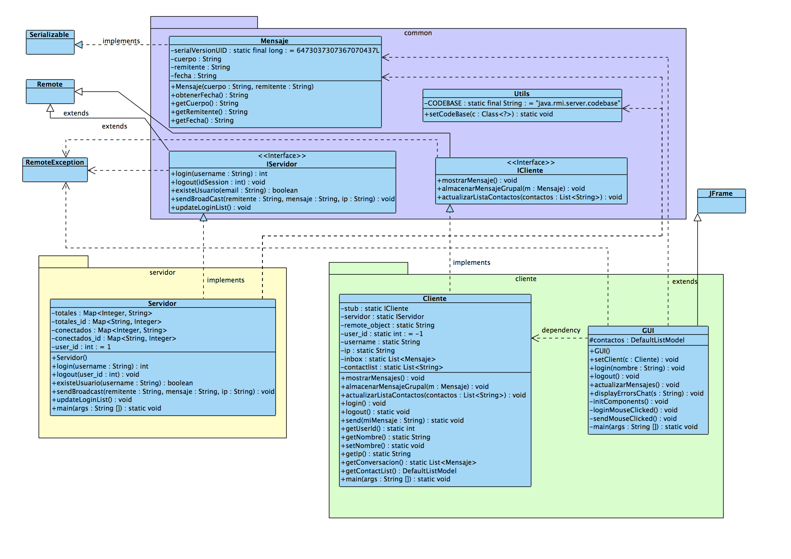

Java RMI
===================

La práctica consiste en una simple aplicación de chat usando Java RMI.

En la práctica se diseñaron e implementaron dos versiones:

- Versión P2P
- Versión Grupal

Cada una de ellas se pueden encontrar en los directorios `P2_p2p`y `P2_grupal` respectivamente.

Se deja como modo de apoyo los diagramas de clases que se realizaron para aclarar más el funcionamiento de esta teconología.

## UML Chat Grupal

## UML Chat P2P
